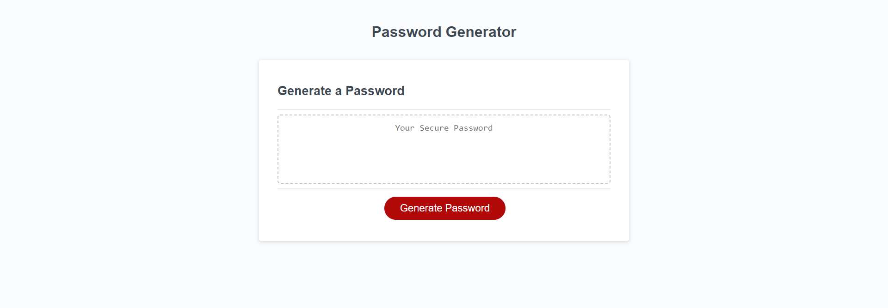

# Password Generator

## Description
This page will generate random passwords from 8 to 128 characters in length. The user can select whether or not to include lowercase and uppercase letters, numbers and a wide assortment of symbols in the password. The page uses window prompts to collect user choices regarding password length and which character types to include. It checks for acceptance criteria of user choices such as if the selected length falls between 8-128 characters, and if at least one character type is selected.

## Usage
URL:  https://danidrury.github.io/password_generator/

## Credits
Random String Generator code from https://attacomsian.com/blog/javascript-generate-random-string

## License
N/A